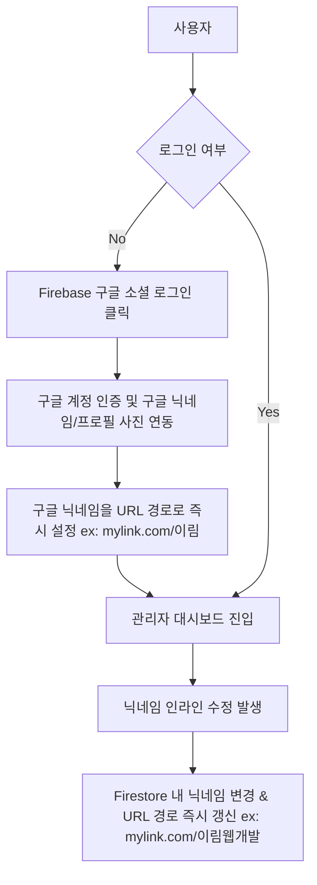

# 📄 제품 요구사항 정의서 (PRD): 마이링크 (MyLink)

> [!NOTE]
> **마이링크(MyLink)**는 채용 담당자(Potential Employers) 및 동료 개발자들에게 나 자신과 포트폴리오를 가장 세련되고 신뢰감 있게 보여주기 위한 **인재 채용/네트워킹 특화 멀티 링크 서비스**입니다. 
> 
> *본 문서는 사용자의 최신 요구사항(닉네임 수정 시 URL 갱신, 모든 편집에 인라인 편집(Inline Edit) 방식 도입, 이미지 업로드 제외, 파이어베이스 연동)을 엄격히 반영한 정의서입니다.*

---

## 1. 프로젝트 개요 (Project Overview)

### 1.1 서비스 개요
채용 전형이나 네트워킹 과정에서 포트폴리오, 깃허브, 이력서, 기술 블로그, 링크드인 등 전달해야 할 링크가 매우 많습니다. **마이링크**는 이러한 파편화된 리소스들을 단 하나의 모던하고 직관적인 프로필 페이지로 통합하여, 채용 담당자와 동료 개발자가 나의 역량을 한눈에 파악할 수 있도록 돕습니다.

### 1.2 서비스 목적
- **인사 담당자(Potential Employers) 유치**: 이력서, 노션 포트폴리오, 링크드인 등을 가장 매력적인 레이아웃으로 노출하여 긍정적인 첫인상을 부여합니다.
- **개발자 동료 네트워킹**: 깃허브, 블로그 등 개발 산출물을 단일 링크로 깔끔하게 정리하여 신뢰성 높은 기술 정체성을 공유합니다.
- **효율적인 프로필 관리**: 파이어베이스 데이터베이스 기반으로, 언제 어디서나 자신의 이력 정보를 실시간 업데이트할 수 있습니다.

### 1.3 대상 사용자 (Target Audience)
1. **Potential Employers (인사/채용 담당자)**: 짧은 시간 안에 지원자의 다양한 역량 채널(포트폴리오, 연락처, SNS)을 쉽고 빠르게 탐색하고자 하는 사람.
2. **Developers (동료 개발자)**: 깃허브, 기술 블로그, 진행한 프로젝트 데모 사이트 등을 한 페이지에 일관된 톤앤매너로 정리하고 싶은 개발자군.

### 1.4 기술 스택 (Tech Stack)
* **Frontend**: Next.js (App Router), Tailwind CSS / Vanilla CSS, React
* **Backend & DB**: Firebase
  * **Authentication**: Firebase Authentication을 통한 **구글 소셜 로그인**
  * **Database**: Cloud Firestore (유저 프로필 및 링크 정보 저장)
  * *비고: 이미지 업로드 기능 제외에 따라 Firebase Storage는 사용하지 않습니다.*

---

## 2. 핵심 기능 목록 (Core Features)

기능의 중요도와 구현 순서를 고려하여 **필수(Must-Have)** 기능하고 **선택(Nice-to-Have)** 기능으로 구분합니다.

| 구분 | 기능명 | 우선순위 | 한 줄 설명 |
| :--- | :--- | :---: | :--- |
| **회원 및 권한** | **구글 소셜 로그인** | **필수** | Firebase Auth 기반 구글 계정 간편 가입 및 로그인 |
| | **닉네임 기반 URL 설정 & 수정** | **필수** | 닉네임 자체를 URL 경로로 활용하며, **닉네임 변경 시 URL 경로도 함께 즉시 갱신** |
| **링크 관리** | **인라인 편집형 링크 카드 CRUD** | **필수** | **대시보드 내에서 모달 창 없이 즉시 텍스트를 클릭하여 수정하는 인라인 편집 지원** |
| | 파비콘 자동 추출 아이콘 | **필수** | 입력한 URL의 파비콘(Favicon)을 자동으로 가져와 링크 카드 아이콘으로 표시 |
| **디자인 관리** | 커스텀 프로필 설정 | **필수** | 구글 프로필 사진 또는 이모지, 타이틀(이름), 온라인 배지, 한 줄 소개(Bio) 설정 |
| | 프리미엄 테마 적용 | **필수** | 그라데이션, 다크 모드 등 세련된 스타일 테마 선택 기능 |
| | 소셜 퀵 링크 | **필수** | 카드 하단에 이메일, 깃허브, 링크드인 등의 SNS 아이콘 링크 수평 배치 |
| **공개 페이지** | 반응형 모바일 뷰 | **필수** | 채용 담당자의 모바일 환경에 최적화된 모바일-퍼스트 반응형 페이지 |
| | 원클릭 공유 & QR | **필수** | 주소 복사 버튼 및 QR 코드 자동 생성 팝업 제공 |
| | SEO 및 공유 설정 | **필수** | 포트폴리오 신뢰성을 높여주는 동적 Meta 태그(og:title, og:image 등) 적용 |

> [!WARNING]
> **제외 대상 기능 (사용자 요청 반영)**
> 1. **별도 핸들(ID) 생성/입력**: 미탑재 (닉네임을 직접 URL 경로로 매핑)
> 2. **이미지 파일 업로드 기능**: 미탑재 (구글 기본 프로필 이미지 연동 또는 이모지 사용으로 단순화)
> 3. **링크 활성화/비활성화 토글 기능**: 미탑재 (삭제 및 생성 구조로 단순화)
> 4. **드래그 앤 드롭 및 순서 정렬 기능**: 미탑재 (등록 시간순 혹은 고정 순서 노출)
> 5. **개발자 특화 복잡 기능**: 미탑재 (일반적이고 직관적인 포트폴리오 뷰어 형태로 포커스)
> 6. **방문자 조회 및 링크 분석 통계 기능**: 미탑재 (향후 사용자가 직접 확장 및 삽입 예정)
> 7. **모바일 뷰 미리보기 (Device Mockup)**: 미탑재 (관리자 대시보드는 순수 입력 폼과 저장 기능 위주로 심플화)

---

## 3. 기능별 상세 설명 (Detailed Feature Specifications)

### 3.1 회원가입 및 프로필 점유 (Authentication & Directory)

* **구글 소셜 로그인 연동**:
  * 구글 계정으로 로그인 성공 시, 구글 계정에 저장된 **닉네임(Name)**과 **프로필 이미지 URL**이 자동으로 Firestore에 동기화됩니다.
* **닉네임 기반 URL 구조 & 인라인 편집 수정**:
  * 구글 계정의 최초 닉네임이 주소 경로가 됩니다.
  * **[인라인 편집 지원]**: 관리자 대시보드에서 프로필 닉네임 영역을 **직접 클릭하면 즉시 입력창(Input)으로 전환**되며 닉네임을 수정할 수 있습니다.
  * **URL 경로 동적 갱신**: 닉네임 수정 완료 시(Blur 처리 또는 Enter 입력), Firestore 내 닉네임 필드가 갱신되며 사용자의 접속 주소 역시 `https://mylink.com/{새로운닉네임}`으로 실시간 변경됩니다.

---

### 3.2 링크 관리 시스템 (Link Management)

> [!IMPORTANT]
> **인라인 편집(Inline Edit) 방식의 강력함**
> 사용자가 복잡한 모달 창을 띄우거나 페이지를 이동하지 않고, **대시보드 화면에 노출된 링크의 타이틀과 URL 텍스트를 마우스로 클릭하면 그 자리에서 즉시 수정 모드(Input 필드)로 토글**됩니다. 입력 후 포커스를 잃거나(Blur) 엔터를 치면 즉시 저장이 수행됩니다.

* **인라인 링크 CRUD**:
  * **추가(Create)**: '새 링크 추가' 버튼 클릭 시 비어있는 임시 인라인 링크 카드가 맨 위에 바로 생성됩니다.
  * **읽기(Read)**: 등록되어 있는 모든 링크를 깔끔한 텍스트 리스트 형태로 확인합니다.
  * **수정(Update - Inline)**:
    * **제목(Title)**: 노출된 텍스트를 클릭하여 그 자리에서 닉네임/타이틀을 직접 타이핑하여 수정.
    * **주소(URL)**: 노출된 주소를 클릭하여 직접 URL을 인라인으로 수정.
  * **삭제(Delete)**: 링크 카드 우측의 작은 '휴지통' 혹은 '삭제' 아이콘 클릭 시 즉시 제거됩니다.
* **파비콘 자동 추출 (Favicon Auto-fetching)**:
  * 인라인으로 수정한 URL의 도메인을 실시간으로 파싱하여, 구글 파비콘 API(`https://www.google.com/s2/favicons?domain={domain}&sz=64`)를 통해 최신 파비콘 썸네일을 링크 카드 왼쪽에 노출합니다.

---

### 3.3 커스텀 디자인 & 프리미엄 테마 (Customization & Themes)

* **이미지 업로드 없는 프로필 브랜딩**:
  * **프로필 아바타**: 
    1. 구글 인증에서 연동된 사용자의 **구글 프로필 기본 이미지**를 사용합니다.
    2. 또는 사용자가 선택한 **이모지(Emoji)**(예: 🧑‍💻, 🚀)를 아바타 영역에 크게 띄워줍니다.
  * **온라인 상태 배지**: 채용 담당자에게 적극적인 구직 의사를 시각적으로 보여주는 녹색 Pulse 배지.
  * **한 줄 소개글(Bio - 인라인 편집 가능)**: 자신을 표현하는 핵심 슬로건을 인라인 편집을 통해 그 자리에서 신속하게 수정 및 저장합니다.
* **프리미엄 테마 프리셋**:
  * **Midnight Glow (메인 기본)**: 은은한 딥 퍼플/블루 배경에 반투명 유리(Glassmorphism) 스타일 카드.
  * **Minimal White**: 정갈한 화이트/샌드 그레이 배경에 깔끔하고 포멀한 분위기.
  * **Slate Tech**: 개발자다운 느낌을 주는 다크 그레이 톤의 슬레이트 컬러 테마.
* **소셜 퀵 링크 (Social Quick Links)**:
  * 프로필 카드 바로 밑에 메일 전송(`mailto:`), 링크드인, 깃허브 주소를 깔끔한 수평 배열 아이콘 세트로 노출해 연락 접근성을 극대화합니다.

---

### 3.4 공개 프로필 & SEO 최적화 (Public Profile & SEO)

* **채용 담당자 모바일 반응형 뷰**:
  * 인사 담당자들이 주로 모바일로 프로필을 열어보는 점을 고려하여 쾌속 렌더링에 최적화합니다.
* **원클릭 공유 & QR 코드 생성**:
  * 원활한 명함 교환 및 소개를 위해 주소 복사(Clipboard Copy) 기능과 QR 코드 생성 팝업 뷰어를 탑재합니다.
* **프로페셔널 SEO**:
  * 소셜 미디어로 프로필 링크 공유 시 **{닉네임}**과 프로필 기본 정보가 메타 데이터에 동적으로 바인딩되어 멋진 공유 카드를 생성합니다.
