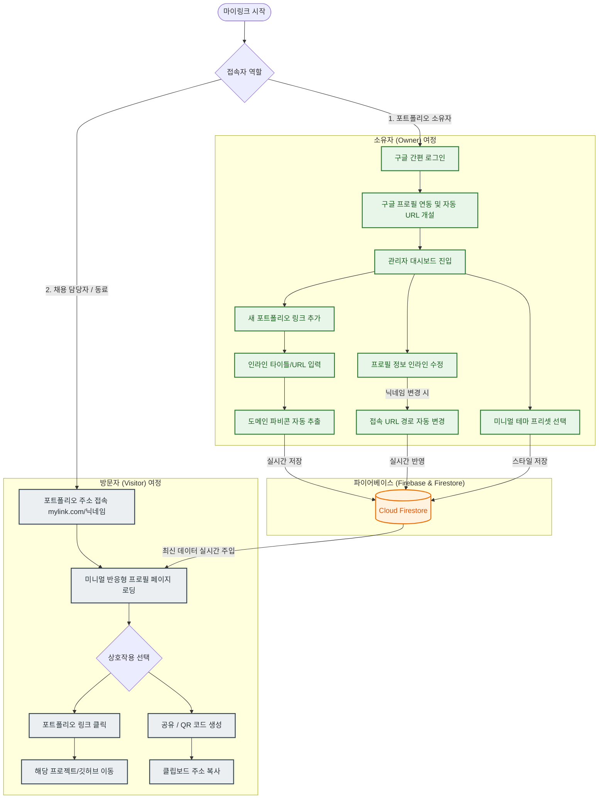

# 📑 사용자 시나리오 (User Scenarios): 마이링크 (MyLink)

> [!NOTE]
> 본 문서는 **"사용자는 [목적]하기 위해 [행동]한다"** 형식을 엄격하게 준수하여 작성된 마이링크(MyLink)의 핵심 유저 시나리오 정의서입니다. 
> 
> 인사 담당자(방문자)와 구직 개발자(소유자)가 시스템을 경험하는 디테일한 여정을 통합 흐름도(Mermaid)와 함께 서술합니다.

---

## 0. 서비스 통합 흐름도 (Service Workflow Diagram)

소유자의 대시보드 관리 흐름 및 방문자(채용 담당자)의 탐색 흐름, 그리고 Firebase 데이터 동기화의 유기적인 관계를 보여주는 다이어그램입니다.

---

## 1. 방문자 (Visitor) 시나리오

인사 담당자(Potential Employers) 및 동료 개발자(Developers)가 소유자의 마이링크 프로필을 탐색하고 상호작용하는 시나리오입니다.

### 1.1 포트폴리오 및 역량 채널 탐색
* **사용자(채용 담당자)는** 지원자의 다방면적 역량과 프로젝트 링크들을 한눈에 편리하게 검토하기 위해, 지원자 이력서에 기재된 마이링크 주소(`mylink.com/닉네임`)를 브라우저에 입력하여 모바일 반응형 프로필 페이지에 접속한다.

### 1.2 핵심 포트폴리오 사이트 유입
* **사용자(방문자)는** 지원자가 개발한 구체적인 서비스의 데모나 동작을 직접 검증하기 위해, 카드 리스트에서 파비콘이 함께 예쁘게 노출된 포트폴리오 링크(예: 깃허브 데모, 프로젝트 사이트)를 터치 또는 클릭하여 해당 외부 주소로 바로 이동한다.

### 1.3 원클릭 주소 공유
* **사용자(채용 팀원)는** 발견한 우수 인재의 마이링크 프로필을 사내 다른 면접관 및 결정권자들에게 빠르고 가볍게 공유하기 위해, 페이지 상단에 노출된 공유(주소 복사) 버튼을 클릭하여 클립보드에 복사한 뒤 슬랙(Slack) 등의 메신저에 붙여넣는다.

### 1.4 오프라인 대면 시 QR코드 활용
* **사용자(면접 현장의 동료 면접관)는** 대면 면접장에서 자신의 태블릿이나 스마트폰 화면으로 지원자의 마이링크 포트폴리오를 빠르게 함께 보며 이야기하기 위해, 지원자가 보여주는 QR코드 팝업 화면을 카메라로 스캔하여 페이지에 접속한다.

---

## 2. 소유자 (Owner) 시나리오

개발자가 구글 로그인을 수행하고, 대시보드 내에서 인라인 편집을 통해 프로필과 링크들을 실시간으로 효율적이게 관리하는 시나리오입니다.

### 2.1 Firebase 구글 간편 로그인
* **사용자(소유자)는** 복잡한 이메일 가입 절차와 비밀번호 기억의 피로도 없이 빠르게 마이링크 서비스를 시작하기 위해, 로그인 첫 화면에서 '구글 계정으로 로그인' 버튼을 클릭하여 간편 인증을 완료한다.

### 2.2 최초 프로필 개설 및 경로 선점
* **사용자(소유자)는** 구글 계정 정보를 바탕으로 자신만의 유일한 온라인 포트폴리오 링크를 빠르게 확보하기 위해, 구글 연동 직후 자동으로 연동된 닉네임 기반의 고유 서브 경로 주소(`mylink.com/구글닉네임`)를 지닌 채 관리자 대시보드 화면에 처음 도달한다.

### 2.3 닉네임 수정 및 접속 URL 갱신 (인라인 편집)
* **사용자(소유자)는** 구글 실명 대신 개발자 직무명이 결합된 전문적인 브랜딩 닉네임으로 외부 노출 주소를 전환하기 위해, 대시보드 프로필 카드의 **닉네임 영역을 직접 클릭하여 '이림_프론트엔드개발자'로 텍스트를 인라인 수정한 후 엔터(Enter) 키를 눌러 접속 주소를 `mylink.com/이림_프론트엔드개발자`로 즉시 변경**한다.

### 2.4 한 줄 소개(Bio) 수정 (인라인 편집)
* **사용자(소유자)는** 채용 담당자에게 자신의 핵심 기술 스택 및 구직 준비 상태(예: *"React와 TypeScript를 사랑하는 프론트엔드 신입 개발자입니다"* )를 적극적으로 어필하기 위해, 대시보드 소개글 텍스트 영역을 **마우스로 클릭하여 텍스트를 인라인 수정한 후 입력 칸 밖의 여백을 클릭(Blur)하여 즉시 저장**한다.

### 2.5 아바타 이미지 또는 이모지 설정
* **사용자(소유자)는** 자신의 실제 이력서용 얼굴 사진을 채용 담당자에게 정중하게 보여주거나 혹은 프라이버시를 지키면서 개발자다운 느낌을 개성 있게 연출하기 위해, 프로필 이미지 영역을 터치하여 **구글 프로필 기본 사진 노출**을 활성화하거나, 귀여운 **이모지(예: 🧑‍💻, 🚀)**를 선택하여 아바타를 장식한다.

### 2.6 링크 추가
* **사용자(소유자)는** 최근에 완성하여 릴리즈한 사이드 프로젝트 주소를 자신의 채용 페이지 최상단에 새롭게 노출하기 위해, '새 링크 추가' 버튼을 눌러 목록 가장 윗부분에 빈 인라인 링크 카드를 생성한다.

### 2.7 링크 정보 입력 및 파비콘 자동 추출 (인라인 편집)
* **사용자(소유자)는** 등록하려는 깃허브 저장소 링크에 유저가 신뢰감을 느낄 수 있는 로고를 일일이 올리지 않고 자동으로 매칭하기 위해, **생성된 임시 카드의 제목(Title) 영역을 클릭해 'MyLink GitHub'로 수정하고, URL 영역을 클릭해 'https://github.com/...'을 입력하여 해당 사이트 고유의 파비콘 썸네일이 카드에 실시간 로드되도록 처리**한다.

### 2.8 테마 스타일 변경
* **사용자(소유자)는** 본인의 전반적인 포트폴리오 톤앤매너를 트렌디하고 감각적인 다크 글래스모피즘 분위기로 단숨에 변신시키기 위해, 디자인 템플릿 패널에서 'Midnight Glow' 테마를 선택하여 단 한 번의 클릭으로 전체 배경과 카드 폰트 색상을 일괄 리스타일링한다.

### 2.9 링크 삭제
* **사용자(소유자)는** 오래되거나 프로젝트를 잠정 중단하여 채용 담당자에게 굳이 보여줄 필요가 없어진 낡은 링크를 깔끔히 제거하기 위해, 해당 링크 카드의 우측 끝에 위치한 '휴지통(삭제)' 아이콘을 원클릭하여 목록에서 즉시 지운다.
